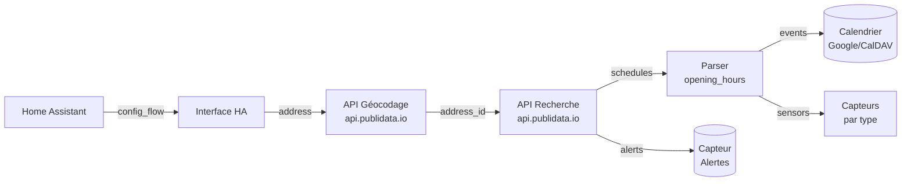
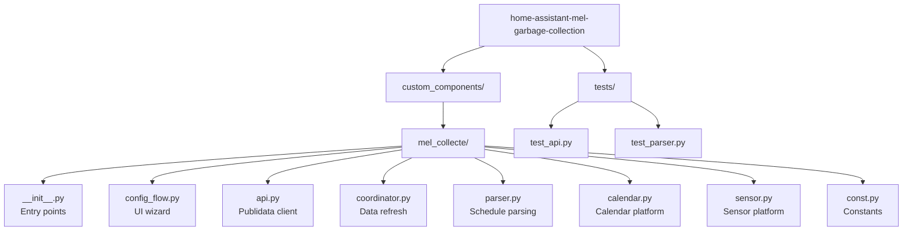

# MEL Collecte des déchets


[](https://github.com/hacs/integration)


> **Ne ratez plus jamais une collecte !** Ce composant personnalisé récupère automatiquement les jours de passage pour la Métropole Européenne de Lille et les expose dans Home Assistant — calendriers, capteurs et alertes en un seul plugin.

---

## Utilisateurs

### Pré-requis

- Home Assistant **2024.6+** (Core, OS ou Supervised)
- Une adresse dans la Métropole Européenne de Lille

### Installation

#### via HACS *(recommandé)*

1. Ajouter ce dépôt comme dépôt personnalisé dans HACS
2. Rechercher **"MEL Collecte des déchets"** et installer
3. Redémarrer Home Assistant

#### Manuelle

1. Copier `custom_components/mel_collecte/` dans `config/custom_components/`
2. Redémarrer Home Assistant

### Configuration

1. **Paramètres → Appareils & services → Ajouter une intégration**
2. Rechercher **"MEL Collecte des déchets"**
3. Saisir l'adresse (ex: `19 rue Gambetta, 59000 Lille`)

L'intégration crée automatiquement les entités ci-dessous.

### Entités créées

| Entité | Type | Description |
|--------|------|-------------|
| `calendar.collectes_des_dechets` | Calendrier | Toutes les collectes à venir (90 jours) |
| `sensor.prochaine_collecte` | Capteur | Prochaine collecte avec attributs détaillés |
| `sensor.jours_avant_prochaine_collecte` | Capteur | Nombre de jours (entier) avant la prochaine collecte |
| `sensor.collecte_<type>` | Capteur | Un capteur par type (`dechets_verts`, `emballages`, …) |
| `sensor.alertes_collecte` | Capteur | Alertes actives du service |

**Attributs disponibles** : `types`, `types_friendly`, `mode`, `debut`, `fin`, `accepted_waste`, `rejected_waste`.

### Affichage recommandé

Pour une carte visuelle, installez [Trash Card](https://github.com/idaho/hassio-trash-card) via HACS :

```yaml
type: custom:trash-card
entities:
  - calendar.collectes_des_dechets
next_days: 120
pattern:
  - label: Ordures ménagères
    icon: mdi:trash-can
    color: grey
    pattern: Ordures ménagères résiduelles
  - label: Déchets verts
    icon: mdi:leaf
    color: green
    pattern: Déchets verts
  - label: Emballages
    icon: mdi:recycle
    color: amber
    pattern: Emballages recyclables
```

---

## Architecture



L'intégration interroge l'API Publidata au démarrage puis **toutes les semaines** (intervalle configurable).

---

## DEVELOPPEURS

### Structure du projet



### Setup local

```bash
# Créer et activer le venv
make install

# Linter et tester
make lint      # ruff + black + mypy
make test      # pytest
make format    # Appliquer black
```

### Commandes utiles

| Commande | Description |
|----------|-------------|
| `make install` | Installe les dépendances |
| `make test` | Exécute les tests pytest |
| `make lint` | Vérifie code (ruff, black, mypy) |
| `make format` | Formate le code avec black |
| `make build` | Génère `mel_collecte.zip` pour HACS |

### APIs Publidata utilisées

1. **Géocodage** — `GET /v2/geocoder?q=<adresse>` → `address_id`
2. **Collectes** — `GET /v2/search?types[]=Platform::Services::WasteCollection&address_id=<id>`
3. **Alertes** — `GET /v2/search?types[]=Alert&states[]=visible&address_id=<id>`

### Parsing des horaires

Le parser (`parser.py`) convertit les chaînes `opening_hours` (ex: `week 1-52/2 Th 05:50-12:50`) en événements calendario. Chaque créneau devient un événement `RRULE` avec récurrence bimensuelle.

### Contribution

1. Forker le dépôt
2. Créer une branche (`feature/xxx` ou `fix/xxx`)
3. Implémenter avec tests + linting (`make lint`)
4. Ouvrir une Pull Request

---

## FAQ

**Aucune entité créée ?** Vérifiez que l'adresse est dans le périmètre MEL.

**Horaires incorrects ?** Les données viennent de Publidata. Ouvrez une issue si un format est mal parsé.

**Comment_forcer un rafraîchissement ?** Vous pouvez appeler le service `mel_collecte.force_refresh` (disponible dans *Outils de développement → Services*) pour rafraîchir les données immédiatement.

---

## Licence

MIT — Contributions bienvenues !
